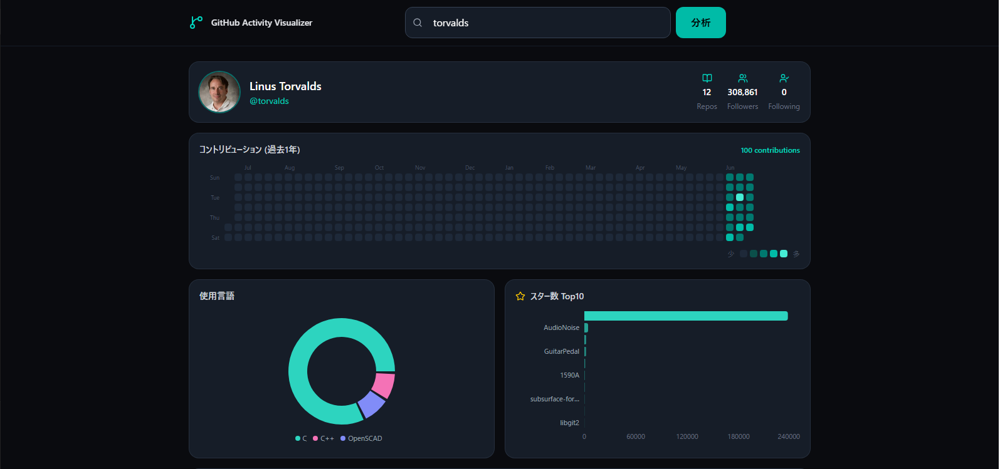

# GitHub Activity Visualizer

GitHubユーザーの活動を複数のチャートでインタラクティブに可視化するダッシュボード。



## デモ

[Live Demo](https://github-activity-visualizer.vercel.app) <!-- デプロイ後に更新 -->

## 機能

- **コントリビューション・ヒートマップ** — 過去1年の草をカレンダー表示
- **使用言語割合** — ドーナツチャートで言語比率を可視化
- **スター数 Top10** — 水平バーチャートでリポジトリをランキング表示
- **月別アクティビティ推移** — エリアチャートでイベント数の時系列変化
- **レスポンシブ対応** — スマホ〜デスクトップで崩れないレイアウト
- **エラー/空状態** — APIレート制限・ユーザー不在時に適切なメッセージ
- **キャッシュ** — 5分間のインメモリキャッシュで過剰リクエスト防止

## 技術スタック

- **React 19 + TypeScript** (Vite)
- **Tailwind CSS v4**
- **Recharts** — PieChart / BarChart / AreaChart
- **date-fns** — 日付処理
- **lucide-react** — アイコン
- **GitHub Public API** — 認証不要

## ローカル起動

```bash
npm install
npm run dev
```

## 工夫した点

- GitHub API の `/events` エンドポイントからヒートマップ・月別推移を両方導出し、追加APIコールを最小化
- Recharts の `animationDuration` + Tailwind の `animate-pulse` でローディング体験を統一
- ダーク基調（`#0a0b0f`）＋ティール（`#2dd4bf`）でポートフォリオ本体と色調を合わせた
